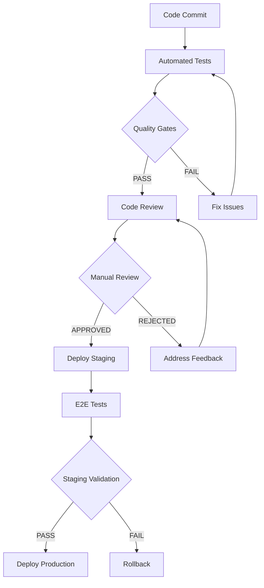

# 🔍 Portes de Qualité - HORDEARII.CA

## 🎯 Vue d'ensemble
Portes de qualité automatisées et manuelles pour garantir la qualité du code et la fiabilité du déploiement.

---

## 🚦 Portes de Qualité Automatisées

### **1. Build Pipeline**
```yaml
# Qualité du code
- Linting (ESLint, Prettier) : ✅ PASS
- Type checking (TypeScript) : ✅ PASS
- Security audit (npm audit) : ✅ PASS
- Dependency check : ✅ PASS

# Tests
- Unit tests : ✅ PASS (coverage ≥80%)
- Integration tests : ✅ PASS
- E2E tests : ✅ PASS
- Performance tests : ✅ PASS

# Build
- Frontend build : ✅ PASS
- Backend build : ✅ PASS
- Docker build : ✅ PASS
- Artifact generation : ✅ PASS
```

### **2. Code Quality Gates**
```yaml
# Métriques de qualité
- Code coverage : ≥80%
- Duplication : ≤3%
- Complexity : ≤10 (cyclomatic)
- Maintainability : A
- Reliability : A
- Security : A

# Violations
- Critical issues : 0
- Major issues : ≤5
- Minor issues : ≤20
- Info issues : ≤50
```

### **3. Security Gates**
```yaml
# Vulnérabilités
- Critical vulnerabilities : 0
- High vulnerabilities : ≤2
- Medium vulnerabilities : ≤5
- Low vulnerabilities : ≤10

# Dependencies
- Outdated packages : ≤5%
- Known vulnerabilities : 0
- License compliance : ✅ PASS
- SBOM generation : ✅ PASS
```

---

## 🔍 Portes de Qualité Manuelles

### **1. Code Review**
```yaml
# Critères obligatoires
- [ ] Code review effectuée
- [ ] Minimum 2 approbations
- [ ] Tous les commentaires résolus
- [ ] Tests ajoutés si nécessaire
- [ ] Documentation mise à jour

# Critères de qualité
- [ ] Code lisible et maintenable
- [ ] Architecture respectée
- [ ] Performance acceptable
- [ ] Sécurité validée
- [ ] Accessibilité vérifiée
```

### **2. Architecture Review**
```yaml
# Design patterns
- [ ] Patterns appropriés utilisés
- [ ] Séparation des responsabilités
- [ ] Couplage faible
- [ ] Cohésion forte
- [ ] Extensibilité assurée

# Performance
- [ ] Requêtes optimisées
- [ ] Cache approprié
- [ ] Pagination implémentée
- [ ] Lazy loading utilisé
- [ ] Bundle size acceptable
```

### **3. Security Review**
```yaml
# Authentification/Autorisation
- [ ] JWT correctement implémenté
- [ ] Permissions granulaires
- [ ] Session management sécurisé
- [ ] 2FA si nécessaire
- [ ] Rate limiting configuré

# Données
- [ ] Validation des entrées
- [ ] Chiffrement des données sensibles
- [ ] Protection contre les injections
- [ ] Logs sécurisés
- [ ] Audit trail implémenté
```

---

## 📊 Métriques de Qualité

### **1. Métriques de Code**
```yaml
# Couverture de tests
Frontend:
  - Unit tests : ≥80%
  - Integration tests : ≥70%
  - E2E tests : ≥60%

Backend:
  - Unit tests : ≥85%
  - Integration tests : ≥75%
  - API tests : ≥90%

# Complexité
- Cyclomatic complexity : ≤10
- Cognitive complexity : ≤15
- Nesting depth : ≤3
- Function length : ≤15 lignes
- Class length : ≤200 lignes
```

### **2. Métriques de Performance**
```yaml
# Temps de réponse
- First Contentful Paint : ≤1.5s
- Largest Contentful Paint : ≤2.5s
- First Input Delay : ≤100ms
- Cumulative Layout Shift : ≤0.1

# API Performance
- Response time (95th percentile) : ≤2s
- Throughput : ≥1000 req/s
- Error rate : ≤0.1%
- Availability : ≥99.9%
```

### **3. Métriques de Sécurité**
```yaml
# Vulnérabilités
- Critical : 0
- High : ≤2
- Medium : ≤5
- Low : ≤10

# Compliance
- GDPR compliance : ✅
- OWASP Top 10 : ✅
- Security headers : ✅
- SSL/TLS : ✅
```

---

## 🚨 Critères de Blocage

### **1. Blocage Automatique**
```yaml
# Sécurité critique
- Vulnérabilité critique détectée
- Secret exposé dans le code
- Injection SQL/XSS confirmée
- Authentification compromise

# Qualité critique
- Couverture de tests <70%
- Build failure
- Linting errors critiques
- Type errors TypeScript

# Performance critique
- Regression de performance >20%
- Memory leak détecté
- Timeout sur les tests
- Bundle size >2MB
```

### **2. Blocage Manuel**
```yaml
# Code review
- Code review non effectuée
- Commentaires critiques non résolus
- Tests manquants pour nouvelles fonctionnalités
- Documentation manquante

# Architecture
- Violation des principes SOLID
- Couplage fort détecté
- Duplication de code >10%
- Anti-patterns identifiés

# Sécurité
- Audit de sécurité échoué
- Permissions trop larges
- Validation insuffisante
- Logs sensibles exposés
```

---

## 🔄 Processus de Validation

### **1. Pipeline de Validation**


### **2. Escalation Process**
```yaml
# Niveau 1 : Développeur
- Fix linting errors
- Add missing tests
- Update documentation
- Resolve code review comments

# Niveau 2 : Senior Developer
- Architecture review
- Performance optimization
- Security validation
- Code quality assessment

# Niveau 3 : Tech Lead
- Critical security issues
- Major architectural changes
- Production deployment approval
- Emergency fixes
```

---

## 📈 Amélioration Continue

### **1. Métriques de Suivi**
```yaml
# Qualité du code
- Technical debt ratio : ≤5%
- Code churn : ≤20%
- Bug density : ≤1 per 1000 LOC
- Time to fix : ≤24h

# Process
- Review time : ≤24h
- Build time : ≤10min
- Deploy time : ≤5min
- Rollback time : ≤5min

# Business
- Feature delivery time : ≤2 weeks
- Bug resolution time : ≤48h
- Customer satisfaction : ≥95%
- System uptime : ≥99.9%
```

### **2. Actions d'Amélioration**
```yaml
# Automatisation
- Automate more quality checks
- Implement auto-fix for common issues
- Add performance regression detection
- Enhance security scanning

# Process
- Regular architecture reviews
- Security training sessions
- Code quality workshops
- Best practices sharing

# Tools
- Upgrade development tools
- Implement new quality metrics
- Add monitoring and alerting
- Enhance CI/CD pipeline
```

---

## 🎯 Objectifs de Qualité

### **1. Objectifs à Court Terme (3 mois)**
- [ ] Couverture de tests ≥85%
- [ ] Zéro vulnérabilité critique
- [ ] Temps de build ≤5 minutes
- [ ] Code review time ≤12h

### **2. Objectifs à Moyen Terme (6 mois)**
- [ ] Couverture de tests ≥90%
- [ ] Performance score ≥95
- [ ] Security score ≥95
- [ ] Automated quality gates 100%

### **3. Objectifs à Long Terme (12 mois)**
- [ ] Zero technical debt
- [ ] 100% automated testing
- [ ] Real-time quality monitoring
- [ ] Predictive quality analysis

---

*Ces portes de qualité garantissent la fiabilité et la maintenabilité du code*
